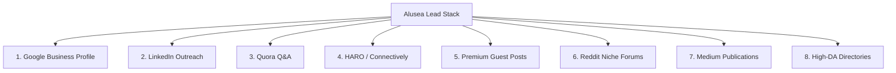

# Alusea B2B & Luxury Retail SEO Roadmap

This document serves as the high-level SEO Roadmap, Backlinks Strategy, and Lead Generation guide for **Alusea Premium Aluminium Systems**. It details our prioritization stack and architectural blueprint for driving organic search traffic and concrete business leads.

---

## 1. Technical SEO & Schema Blueprint (Implemented)

We have successfully integrated advanced microdata across the codebase to help Google understand Alusea's local presence, product collections, testimonials, and FAQs.

### LocalBusiness & Organization Graph Schema (`src/app/layout.tsx`)
*   **Purpose**: Enhances Local SEO maps, reviews snippet, and knowledge panels.
*   **Target Queries**: `Alusea aluminium Coimbatore`, `Aluminium windows manufacturer Coimbatore`, `Aluminium window supply Tamil Nadu`.
*   **Rating Snippet**: Promotes star ratings in organic search using high-profile testimonial reviews.

### Product Collection Schema (`src/app/products/ProductsClient.tsx`)
*   **Purpose**: Structures product listings for search indexing (Minimalist Sliding Doors, Thermal Break Casements, Curtain Wall Glazing).
*   **Features**: Includes price per square foot ranges (`lowPrice: 800`, `highPrice: 2500` INR per SQFT depending on specifications).

### FAQPage Schema (`src/app/products/ProductsClient.tsx`)
*   **Purpose**: Dynamically renders high-value FAQs in search engine result pages (SERPs) to take up maximum screen real estate.
*   **Target Queries**: `Advantages of thermal break aluminium windows`, `commercial aluminium facade contractor specifications`.

---

## 2. Lead Generation Priority Stack

To establish market authority and capture high-intent inquiries from builders, architects, and luxury homeowners, we focus on the following 8 priority areas:

### 1. Google Business Profile (Priority 1)
*   **Objective**: Dominate "near me" map search queries in Coimbatore and wider Tamil Nadu.
*   **Tactics**:
    *   Complete profile as **Alusea Experience Center**.
    *   Maintain high-definition geotagged photos of physical installations.
    *   Solicit architectural reviews from Coimbatore residential and commercial clients (matching keywords such as "best curtain wall glazing supplier").

### 2. LinkedIn Outreach (Priority 2)
*   **Objective**: Build direct B2B pipelines with architects, interior designers, commercial contractors, and builders.
*   **Tactics**:
    *   Share deep-dive articles on `"Thermal break aluminium window specifications"` and load-bearing calculations.
    *   Direct outreach with custom case studies of minimalist sliding door villas across South India.

### 3. Quora Answers (Priority 3)
*   **Objective**: Capture informational traffic from prospects researching window brands, thermal efficiency, and home renovation costs.
*   **Tactics**:
    *   Answer highly searched threads: *"What are the advantages of thermal break aluminium windows?"* or *"How much do slimline glass sliding doors cost in India?"*.
    *   Build backlinks with organic anchor text pointing to Alusea's FAQ-rich Products page.

### 4. HARO (Help a Reporter Out) Responses (Priority 4)
*   **Objective**: Generate extremely high-authority editorial backlinks from major news publications (Forbes, Architectural Digest, etc.).
*   **Tactics**:
    *   Monitor daily queries under Business/Tech/Lifestyle for sustainable construction, architectural trends, or green home design topics.
    *   Pitch high-quality quotes authored by the Chief Engineer on energy-efficient glazing and structural facade technology.

### 5. Premium Guest Posts (Priority 5)
*   **Objective**: Obtain contextual backlinks from authoritative architectural, interior design, and real estate blogs.
*   **Tactics**:
    *   Write educational content detailing modern fenestration trends: *"Why Minimalist Aluminium Sliding Doors Are Dominating Luxury Indian Villa Designs."*
    *   Link naturally using semantic anchors like *"luxury aluminium facade supplier South India"*.

### 6. Reddit Communities (Priority 6)
*   **Objective**: Engage in organic grass-roots discussions regarding premium building materials and local recommendations.
*   **Tactics**:
    *   Monitor `r/Coimbatore`, `r/Chennai`, `r/InteriorDesign`, and `r/architecture`.
    *   Provide helpful, non-promotional technical advice regarding soundproofing and glazing, referencing Alusea only when highly relevant.

### 7. Medium Publications (Priority 7)
*   **Objective**: Establish a publication hub for technical specifications and engineering deep-dives.
*   **Tactics**:
    *   Publish comprehensive checklists: *"A Builder's Guide to Commercial Aluminium Facade Contractors and Thermal Break Window Specifications."*

### 8. High-DA B2B Directories (Priority 8)
*   **Objective**: Create structural local backlinks and register in procurement channels.
*   **Tactics**:
    *   Create detailed profiles on Indiamart, TradeIndia, and Sulekha, targeting `aluminium window supply Tamil Nadu` and `commercial aluminium facade contractor Coimbatore`.

---

## 3. Internal Linking Matrix

We have optimized the internal anchor distribution to guide crawlers and keep human users engaged. Here is our linking structure:

| From Page | To Page | Anchor Text Used | SEO Purpose |
| :--- | :--- | :--- | :--- |
| `Home (sr-only)` | `/products` | `thermal break aluminium window specification` | Passes juice to high-intent product specs |
| `/about` | `/` | `aluminium window doors manufacturer in Coimbatore` | Drives local domain authority to the root URL |
| `/about` | `/products` | `luxury aluminium window fabricator in Tamil Nadu` | Directs high-end buyers to the collection |
| `/about` | `/services` | `architectural glazing manufacturer in South India` | Promotes service capabilities |
| `/services` | `/` | `architectural glazing manufacturer in South India` | Closes the circular crawling loop |
| `/products` | `/` | `aluminium windows manufacturer in Coimbatore` | Links commercial category terms back to root |
| `/products` | `/contact` | `commercial aluminium facade contractor in Coimbatore` | Converts high-intent readers on services |

---

## 4. Maintenance Checklist

1. **Verify Schema Validation**: Test the live home and products page URLs via Google's [Rich Results Test Tool](https://search.google.com/test/rich-results) quarterly to ensure there are no parser errors.
2. **Monitor Search Console**: Track queries containing `Alusea` to measure brand recall, and local queries containing `Coimbatore` to monitor optimization gains.
3. **Regular FAQ Updates**: As prospective buyers ask new questions regarding price per sqft or specifications, add them to the interactive FAQ block on `/products` to dynamically enrich the Page schema.
